# autoproduct — Design Documentation (Full-Lifecycle Edition)

`autoproduct` is a multi-agent system built as **two loops**. The **inner loop** covers **eight stages** of the software development cycle: **discovery, planning, specification, coding, code review, test, deployment review, and production maintenance**. The four downstream stages run heterogeneous specialist voters over pull requests and production signals; the four upstream stages run single-writer generators whose artifacts are critiqued by the same voter/verify/leader machinery. Deterministic tools run alongside every stage, escalations surface through human-in-the-loop gates, and structured learning accumulates over time.

The **outer loop** (docs 20–23) wraps it with six product stages — **opportunity sensing, market & viability, product definition (PRD), launch & growth, product evidence, portfolio prioritization** — running at a weeks-to-months cadence. Its foundation is a typed, machine-linted claim ledger: the outer loop has no compiler, no test suite, and no type checker, so `claim_lint` is built to be what `ears_lint` is upstream. The outer loop prepares evidence and options; humans decide at Gates PL1, PL2, PL3, and PL5.

**Architectural posture (unchanged from `11-ultimate-architecture.md`, now applied end-to-end):** spec-driven (every agent has a machine-checked YAML frontmatter contract; modules have `.mas/specs/*.spec.yaml` invariants; upstream artifacts have machine-checked schemas), MCP-transport (tools live in subprocess-isolated MCP servers with per-tool RBAC), harness-enforced (no agent registers without passing its fixture gate; contract violations are unrecoverable, not warnings).

This directory holds the authoritative design documentation.

```mermaid
flowchart LR
    subgraph UP["Upstream (docs 12-14) - single writer + critique voters per stage"]
        D["1 Discovery<br/>brief + hypothesis ledger"] -->|Gate U1| P["2 Planning<br/>task DAG + lanes + budget"]
        P -->|Gate U2: scope lock| S["3 Spec<br/>design.md + EARS + contracts"]
        S -->|Gate U3: arch ack| C["4 Coding<br/>test-first, build gate"]
    end
    subgraph DOWN["Downstream (docs 08-11) - heterogeneous voters, verify pass, leader"]
        R["5 Code Review"] --> T["6 Test<br/>mutation + UI"] --> DR["7 Deploy Review"] --> M["8 Maintenance"]
    end
    C -->|PR + evidence + changelog| R
    C -.->|SCR: spec change request| S
    R -.->|root-cause labels| S
    M -.->|hypothesis reconciliation| D
    M ==>|weekly compounding PR| K[("skills, fixtures,<br/>templates")]
    K -.-> R
    K -.-> S
    subgraph OUT["Outer product loop (docs 20-23) - weeks to months, WIP 1-2"]
        O0["P0 Opportunity<br/>real signals only"] -->|Gate PL0| O1["P1 Market<br/>bottom-up range"]
        O1 -->|Gate PL1 human| O2["P2 PRD<br/>outcomes + kill criteria"]
        O3["P3 Launch and Growth<br/>draft-and-approve"] -->|Gate PL3 human| O4["P4 Product Evidence<br/>cohorts + holdouts"]
        O4 --> O5["P5 Portfolio<br/>kill / pivot / continue"]
    end
    O2 ==>|Gate PL2: handoff contract| D
    DR --> O3
    O5 -.->|Gate PL5 human| O0
    O5 -.->|iterate: revised PRD| O2
```



*Every stage: deterministic tools run first, parallel independent voters critique (never debate), every finding is independently verified, a Leader synthesizes, and a gate — human where judgment is the point — releases the artifact. AgentHire is the running example project used throughout. Independent 2026 production review pipelines converged on this same shape (see `15-validation-and-traceability.md` §6).*


## Reading order

```
08-foundation.md            → Problem statement, research foundation, architecture overview (downstream 4 stages)
09-system-design.md         → Downstream rosters, state machine, gates, tools, HITL, deploy MAS, maintenance MAS, observability
10-implementation-plan.md   → Downstream 24-30 week plan (v0.1.0 → v1.0.0)
11-ultimate-architecture.md → Architectural keystone: spec-driven + MCP transport + harness enforcement
12-upstream-foundation.md   → Why upstream stages, generative-stage research base, how the architecture extends (Parts 22-24)
13-upstream-system-design.md→ Discovery/Plan/Spec/Coding MASes at full depth: rosters, skills, graphs, gates, verdicts,
                              fixtures, policies, feedback loops, metrics, FMEA, ADRs (Parts 25-36)
14-upstream-implementation-plan.md → 12-week upstream track with day-level detail, appendices E-H (Part 37)
15-validation-and-traceability.md  → Five-perspective validation + traceability matrix to the methodology reference
16-scaling-and-continuous-operation.md → Cross-feature scaling, the bounded outer loop (WIP limits, gate-latency metric), 2026-H2 technique radar (Parts 38-40)
17-domain-profiles.md              → Client-domain profiles: web, 小程序 mini-program, mobile app, game — deterministic checks, voter deltas, platform-review gates (Parts 41-45)
18-traditional-industry-gap-closure.md → Traditional-enterprise adoption: substrate ladder (S0-S4), Java/.NET promotion, Gate R
                              (regulated change control), data-pipeline + ERP-extension profiles, enterprise hardening (Parts 46-50)
19-gap-closure-implementation-plan.md  → 24-week gap-closure track (G1-G24) with day-level detail, appendices I-L (Part 51)
20-product-loop-foundation.md → The outer loop: why two loops, the typed claim ledger + claim_lint, P0 opportunity
                              sensing, P1 market & viability, P2 PRD and the outer→inner handoff (Parts 52-56)
21-launch-and-growth.md     → P3: the autonomy ceiling, seven deterministic marketing backstops, channel
                              profiles, the GEO sub-profile, the pre-registered two-stage experiment MAS (Parts 57-61)
22-feedback-and-the-double-loop.md → P4 product evidence, attribution typing, user_data_taint, P5 prioritization
                              and kill criteria, ADRs U19-U25, invariants 14.14-14.20, FMEA, metrics (Parts 62-66)
23-product-loop-implementation-plan.md → 16-week product-loop track (P1-P16), appendices M-P (Part 67)
24-platform-and-personas.md → One spine, three doors: editions E1 traditional-industry / E2 solo-OPC 一人公司 / E3 engineer
                              as narrowing preset bundles — gate consolidation as scheduling, never deletion (Parts 68-72)
25-distribution-and-ecosystem.md → Time-to-first-value ladder (offline replay, no API key), product-bench as the public
                              benchmark, opt-in telemetry, README linted by its own claim tools in CI (Parts 73-76)
26-performance-and-load-lane.md → Lintable perf ACs (EARS extension), k6/Locust det slots, VALID-run typing,
                              capacity.yaml at Gate 5 — "high traffic" becomes a checkable claim (Parts 77-78)
27-realtime-and-streaming-deltas.md → Netcode: declared net_model, det_sim_scan, replay-identity fixtures, desync=incident;
                              streaming: declared-never-defaulted schema compatibility, contracts, backpressure (Parts 79-80)
28-architecture-evolution-and-delivery.md → Dependency contracts compiled from design.md, SCR-class module graph, environments,
                              flag registry with expiry, migration rehearsal; track P21-P26 (Parts 81-83)
29-sweep-role.md            → The Sweep role: scheduled janitorial passes over the ledgers the canon already keeps —
                              allowlisted, behavior-preserving, attention-capped; SW0-SW2 trust ladder (Parts 84-85)
day-0-calibration.md        → Track A (downstream, unchanged) + Track B (upstream) calibration experiments
```

Read 08 → 09 cover-to-cover for downstream; 12 → 13 cover-to-cover for upstream; 10/14/19/23 as reference; 11 as the integration keystone for both. Read 18 if you are adopting outside a modern-stack product team (traditional enterprise, data teams, ERP estates). Read 20 → 21 → 22 if you are deciding *what* to build and not only how — and read 20 Part 53 first regardless, because the claim substrate is what makes the rest safe. Read 24 to choose your door (enterprise / solo / engineer) and 25 before installing anything or publishing any number about the system itself. Read 26–28 if your target is high-traffic, realtime/multiplayer, or streaming-data systems, or a codebase that must stay coherent across many features.

## Scope

`autoproduct`'s **inner loop** covers eight stages of the SDLC:

| Stage | What the MAS does | Motivation |
|---|---|---|
| **Discovery** | Single ProductBrief writer + Desirability/Feasibility/Viability/Scope voters; hypothesis ledger with evidence classes; every claim sourced or tagged assumption | Bad problem framing is unrecoverable downstream |
| **Planning** | Planner writer emits a task DAG; deterministic dag/lane checks; Completeness/Dependency/Risk/Parallelization/Estimate voters | ~42% of MAS failures are specification/system-design class ([MAST, arXiv:2503.13657](https://arxiv.org/abs/2503.13657)) — the plan is where they enter |
| **Specification** | SpecWriter emits design.md (architecture delta) + EARS acceptance criteria + contracts + module-spec deltas + test skeletons; ears_lint/coverage-matrix deterministic; Testability/Consistency/Completeness/Ambiguity/Interface voters | Machine-checkable specs and an explicit, human-acknowledged design are the anchor every later gate verifies against |
| **Coding** | Single-writer implementer per worktree lane; test-first from test specs; deterministic build gate; spec-gap back-edge (SCR) to Specification | Write-heavy work is deliberately *not* parallel-voted — generation is single-writer, judgment lives in Code Review |
| **Code Review** | 6+ heterogeneous voters, deterministic tools alongside, every finding independently verified | Catch bugs before merge |
| **Test** | Adversarial mutation testing, UI test generation, structured test report | Ensure tests cover the change |
| **Deployment Review** | Voters review CI/CD config, IaC, migrations, canary policies; Argo Rollouts / Flagger integration | Catch deploy-time risks before exposure |
| **Production Maintenance** | Triage/RootCause/FixPR voters over Sentry/Datadog/PagerDuty signals; learned-skill registry; hypothesis-ledger reconciliation | Resolve incidents quickly; close the *system* loop |

Its **outer loop** (docs 20–23, ADR-U19) covers six product stages:

| Stage | What the MAS does | Motivation |
|---|---|---|
| **P0 Opportunity Sensing** | Ingests declared-standing signals (owned support/analytics first, public feedback and community second), clusters them, ranks candidates; Signal-Strength/Novelty/Fit/Falsifiability/Duplication voters | An inner loop with no opportunity intake efficiently builds whatever was asked for |
| **P1 Market & Viability** | Bottom-up sizing with mandatory sensitivity ranges, probe-derived competitor facts, and a dedicated **Disconfirmation voter**; quarantined retrieval per CaMeL | The invented TAM is the outer loop's package hallucination — and the retrieved corpus is now actively adversarial ([arXiv:2404.07981](https://arxiv.org/abs/2404.07981), [arXiv:2606.13610](https://arxiv.org/abs/2606.13610)) |
| **P2 Product Definition** | PRD with measurable outcomes, required non-goals, required **kill criteria**, and instrumentation that either exists or becomes a Planning task | A success metric nobody wired up is how a product loop silently stops being a loop |
| **P3 Launch & Growth** | Seven deterministic backstops (substantiation, disclosure, deliverability, spam-policy, brand safety, GEO extractability, UTM) before any voter; channel profiles as deltas; pre-registered two-stage experiments | Measured FDR in A/B testing is 18–25% at α=0.05 with ~70% true nulls ([Management Science](https://pubsonline.informs.org/doi/10.1287/mnsc.2021.4207)) — an agent generating twenty variants is a false-discovery machine unless the design stops it |
| **P4 Product Evidence** | Cohort-correct readings against PRD outcomes, hypothesis verdicts against pre-stated falsifiers, attribution typed at the tool boundary | Stage 8 sees a healthy system; P4 sees a product with 100% uptime and 4% activation |
| **P5 Portfolio Prioritization** | Evaluates kill criteria and loop budget mechanically, assembles the decision packet, routes to P0/P1/P2 — never straight into the inner loop | Without a forced kill decision the loop is a ratchet |

The system remains **autonomous within bounded autonomy**: every stage operates on the same 3-fail-then-escalate pattern (§08.1.5, extended in §12.24.2). Production-mutating actions, merges to main, scope unlocks, and contract-breaking spec changes are gated by structural enforcement and human approval.

### What's new in this edition

- Four upstream stage MASes at the same granularity as downstream (rosters, skills, state machines, verdict taxonomies, fixture gates, policies).
- The **generate → tools → critique-vote → verify → leader → gate** uniform template for generative stages (§12.24.1), preserving vote-don't-debate and single-writer principles.
- The **Spec Change Request (SCR)** back-edge: coding discovers spec holes and routes them back through Specification instead of silently drifting (§13.29.6, ADR-U02).
- The **hypothesis ledger**: Discovery's assumptions become Maintenance-stage telemetry checks after launch — the product loop closes (§13.34.3).
- `.mas/authoring-policy.yaml` with upstream trust tiers and an extended `forbidden_autonomous` ceiling (§13.32).
- Five upstream MAS metrics mirroring the five downstream ones (§13.33.1).
- An explicit **design artifact** (`spec/design.md`) with two-pass planning resolving the Spec-Kit/Kiro ordering split (ADR-U07, §13.28.2).
- Per-task **changelog fragments** rolling up into release notes (§13.34.4).
- A validation & traceability report against the source methodology and research base (doc 15).
- Cross-feature scaling and continuous operation under WIP limits and a human-attention budget, plus a verified technique radar — GEPA-powered compounding, CaMeL-staged injection defense, voter cascades with a heterogeneity floor (doc 16).
- Domain profiles making frontend work first-class — web (Playwright/visual baselines/CWV budgets), WeChat mini-programs (package/domain/privacy preflight, review-train gates), mobile apps (Maestro flows, device tiers, store gates), and games (determinism checks, bot playtests, the human playtest gate) — as composable deltas, never forks (doc 17).
- The traditional-industry adoption track (docs 18–19, ADR-U15..U18): a substrate-adoption ladder (S0–S4) where stages below their infrastructure floor are inactive-never-degraded and upstream stages are the zero-infrastructure wedge; Gate R modeling CAB/SOX-class change control as an external gate feeding the compounding loop; Java/.NET promoted to first-class via fixture-gated toolchains with a published seeded-defect catch-rate; data-pipeline and ERP-extension domain profiles; and enterprise deployability (SSO on HITL gates, attestation ledger, VPC reference deploy).
- The **product loop** (docs 20–23, ADR-U19..U25): a second, slower loop around the eight-stage spine. Its foundation is the **typed claim ledger** — every quantitative or comparative assertion carries a `source_type`, a reproducible locator, a hashed evidence snapshot, an n, and a falsifier, and `claim_lint` fails the gate on unsourced numbers, causal language without a holdout, proportions without denominators, expired evidence, and model-inference over a per-stage ceiling. On top of it: agents may never generate user needs, personas, or testimonials (ADR-U23); publishing, sending, and public-property changes are `forbidden_autonomous` (ADR-U19) and the framework never spends money (ADR-U20); GEO is admissible only in its verifiability-increasing form and retrieval manipulation is blocked by construction (ADR-U21); experiments are hash-pinned pre-registrations with two-stage FDR control and underpowered tests are simply not run (ADR-U24); causal claims require a holdout and attribution methods are typed at the tool boundary (ADR-U25); person-level data never leaves the analytics boundary (`user_data_taint`, invariant 14.16); and a fired kill criterion cannot be closed without a recorded human decision (invariant 14.20).
- **Complex-systems gap closure** (docs 26–28, ADR-U30..U35): performance becomes a first-class lane — lintable perf ACs, typed VALID/INVALID load-test runs, capacity models at Gate 5, seeded perf-defect calibration; realtime gets declared network models, simulation-determinism scanning, and replay-identity fixtures where a desync is an incident (invariant 14.26); streaming gets declared-never-defaulted schema compatibility with CI contract gates and honest enforcement-boundary labeling; architecture erosion is countered by dependency contracts compiled from `design.md` and an SCR-class module graph (invariant 14.27); delivery gains an environment promotion model, a flag registry with owners and expiry, and migration rehearsal as a Gate 5 precondition (invariant 14.28).
- **The Sweep role** (doc 29, ADR-U36/U37): a scheduled, attention-capped janitor whose inbox is the union of ledgers the canon already keeps — expired flags, checkpoint debt, stale claims and capacity entries, watch-item review dates, contract drift. Allowlisted chore classes only, under a behavior-preservation contract (out-of-scope diffs abort the PR — invariant 14.29); no-action is a first-class recorded outcome and over-action is the measured failure mode (invariant 14.30); every patch rides the unchanged Stage 1-4 gates on an SW0→SW2 phased-trust ladder.
- **Platform & distribution** (docs 24–25, ADR-U26..U29): persona editions as *narrowing* preset bundles over the unchanged spine — E1 ships the procurement pack and pilot-to-production contract that the converting 12% of enterprise pilots already practice; E2 makes solo-founder attention the design center (weekly founder review, `dwell` as a blocking exit criterion, gate consolidation that schedules but never deletes — invariant 14.22); E3 exposes fixture-gated extension points where no unfixtured skill can register. Distribution runs on a time-to-first-value ladder whose first rung needs no API key; product-bench becomes the published benchmark under n-labeled, PROVISIONAL-honest reporting rules (invariant 14.23); telemetry is opt-in, aggregate-only, and inspectable (ADR-U28); and the repo's own README is parsed in CI against its own claim ledger — asserting beyond it fails the build (ADR-U29).
- Errata applied to §08.2.2.10 (slopsquatting rate nuance) — see §12.24.4.

### Explicitly out of scope (still)

- **Executing real-user research.** Discovery drafts interview guides and hypothesis ledgers; talking to humans, running surveys, and validating hypotheses with real users is human work. The system never fabricates user evidence (§13.26.7 charter extension).
- **Product strategy ownership.** Problem selection, scope-tier lock, and roadmap priority are human decisions at Gate U1/U2 — the system prepares options, never chooses.
- **Auto-merge to main. Auto-deploy to production. Auto-hotfix. L4 tools.** Unchanged from the prior edition.
- **Scope changes without an SCR.** After Gate U2 locks scope, the only path to change it is a human-approved Spec Change Request.
- **Visual/UX design authorship** (the system consumes design specs and can verify fidelity against them — doc 17; it does not author pixel design).
- ~~**Pricing, GTM, launch marketing.**~~ *Revised by docs 20–23 (ADR-U19), narrowly.* The outer loop drafts positioning, pricing analysis, and launch assets and runs the experiments that evaluate them — but every external act (publish, send, modify public property, respond as brand, submit) is `forbidden_autonomous` and requires a scoped, per-artifact human approval that never generalizes. **The framework never spends money** — no paid acquisition, no bidding, no budget action, in any tier, ever (ADR-U20). Problem selection, scope-tier lock, pricing decisions, and roadmap priority remain human decisions at Gates PL1/PL2/PL5.
- **Fabricated user evidence, of any kind.** Strengthened, not relaxed: agents may cluster and count real artifacts with resolvable locators, and may never author a persona quote, testimonial, review, or synthetic user need (ADR-U23). This is charter (§13.26.7), enforced by `synthetic_persona_scan` and `disclosure_lint`, and — in the marketing direction — the FTC's per-se treatment of fabricated reviews under the amended Endorsement Guides.
- **Retrieval manipulation.** Hidden or cloaked text aimed at models, instruction-shaped content targeting reading agents, fabricated entity associations, synthetic authorship, and mass query-variant fan-out are blocked by construction, not by policy text (ADR-U21). The system depends on a clean corpus for its own P1 research; polluting one would be incoherent as well as wrong.
- **Multi-tenant SaaS. Self-modifying code.** Unchanged. *(Revised by doc 18: enterprise deployability — SSO, attestation ledger, VPC self-hosting — is now in scope per ADR-U17, and Java/.NET are promoted to first-class via fixture-gated toolchains per ADR-U16. Multi-tenancy and SaaS packaging remain out.)*
- **Vanilla ERP configuration and plant-floor OT control.** The ERP-extension profile (§18.48.2) covers custom code and integrations only; OT/SCADA targets are advisory-only forever (ADR-U18).

## Conventions

- English throughout.
- Citations are inline hyperlinks in practitioner style. Only verified sources are cited; industry-consensus claims are phrased as such.
- Code is Python 3.11+, real and runnable where shown.
- Cross-references: `§13.28` means document 13, Part 28. Within a doc: `§28`. Outer-loop gates carry the `PL` prefix (`Gate PL1`) because `Gate P1` was already the external-platform-review gate class of §17.41.3.
- Documents 08–11 are canonical for downstream stages; 12–14 for upstream; 17 for client-domain profiles; 18–19 for the traditional-industry adoption track; 20–23 for the outer product loop. On conflict, the change-control protocol (§10 Part 11) applies: the newest accepted decision wins and must be recorded.

## Bootstrapping (chicken-and-egg, updated)

Downstream bootstrapping is unchanged (README prior edition; use `/review`-class stand-in tools until v0.1.0 dogfoods itself). Upstream bootstrapping: while the upstream track (weeks U1-U12, doc 14) is being built, use Claude Code's planning/spec workflows (or equivalent) as stand-ins for Plan/Spec generation, and hand-write the EARS criteria for autoproduct's own upstream features. The first feature the upstream system specs end-to-end should be one of its own Week U5+ features — any spec hole the stand-in missed but the Spec MAS catches becomes a fixture in `tests/integration/voters/fixtures/upstream/`.

**Caveat:** stand-in tools do not enforce evidence classes on hypotheses or run ears_lint. Until U2, manually tag every hypothesis in briefs as measured/sourced/assumed and manually check EARS grammar — these are the two highest-value upstream disciplines and the ones stand-ins skip.

## Archive

`archive/` contains the design evolution (seven prior iterations of the downstream design, the prior README and day-0 superseded by this edition) plus the external methodology reference. Preserved for historical context. Superseded by 08–14.

## Repository meta

`LICENSE` (MIT — swap the holder or license if you prefer, see PUBLISHING.md) · `CONTRIBUTING.md` (change-control protocol, what to contribute, the citation calibration rule) · `SECURITY.md` (design-level reporting + OWASP LLM Top 10 : 2025 control mapping) · `PUBLISHING.md` (remaining owner decisions before/after going public) · the [ai-product-autopilot](https://github.com/melodygaoyifan/ai-product-autopilot) reference implementation (the outer-loop deterministic backstops — substantiation, disclosure, deliverability, spam-policy, experiment design, attribution typing, kill criteria — runnable and fixture-gated; `uv run pytest`) · `15-validation-and-traceability.md` (five-perspective validation, research index, traceability matrix).

**Disclaimer:** cost, time, and threshold numbers are engineering defaults calibrated by the Day-0 experiments; run Day-0 before trusting any week plan.
