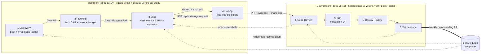

# autoproduct — Design Documentation (Full-Lifecycle Edition)

`autoproduct` is a multi-agent system that now covers **eight stages** of the software development cycle: **discovery, planning, specification, coding, code review, test, deployment review, and production maintenance**. The four downstream stages run heterogeneous specialist voters over pull requests and production signals; the four upstream stages run single-writer generators whose artifacts are critiqued by the same voter/verify/leader machinery. Deterministic tools run alongside every stage, escalations surface through human-in-the-loop gates, and structured learning accumulates over time.

**Architectural posture (unchanged from `11-ultimate-architecture.md`, now applied end-to-end):** spec-driven (every agent has a machine-checked YAML frontmatter contract; modules have `.mas/specs/*.spec.yaml` invariants; upstream artifacts have machine-checked schemas), MCP-transport (tools live in subprocess-isolated MCP servers with per-tool RBAC), harness-enforced (no agent registers without passing its fixture gate; contract violations are unrecoverable, not warnings).

This directory holds the authoritative design documentation.



*Every stage: deterministic tools run first, parallel independent voters critique (never debate), every finding is independently verified, a Leader synthesizes, and a gate — human where judgment is the point — releases the artifact. AgentHire is the running example project used throughout. Independent 2026 production review pipelines converged on this same shape (see `15-validation-and-traceability.md` §6).*


## Reading order

```
08-foundation.md            → Problem statement, research foundation, architecture overview (downstream 4 stages)
09-system-design.md         → Downstream rosters, state machine, gates, tools, HITL, deploy MAS, maintenance MAS, observability
10-implementation-plan.md   → Downstream 24-30 week plan (v0.1.0 → v1.0.0)
11-ultimate-architecture.md → Architectural keystone: spec-driven + MCP transport + harness enforcement
12-upstream-foundation.md   → Why upstream stages, generative-stage research base, how the architecture extends (Parts 22-24)
13-upstream-system-design.md→ Discovery/Plan/Spec/Coding MASes at full depth: rosters, skills, graphs, gates, verdicts,
                              fixtures, policies, feedback loops, metrics, FMEA, ADRs (Parts 25-36)
14-upstream-implementation-plan.md → 12-week upstream track with day-level detail, appendices E-H (Part 37)
15-validation-and-traceability.md  → Five-perspective validation + traceability matrix to the methodology reference
16-scaling-and-continuous-operation.md → Cross-feature scaling, the bounded outer loop (WIP limits, gate-latency metric), 2026-H2 technique radar (Parts 38-40)
17-domain-profiles.md              → Client-domain profiles: web, 小程序 mini-program, mobile app, game — deterministic checks, voter deltas, platform-review gates (Parts 41-45)
day-0-calibration.md        → Track A (downstream, unchanged) + Track B (upstream) calibration experiments
```

Read 08 → 09 cover-to-cover for downstream; 12 → 13 cover-to-cover for upstream; 10/14 as reference; 11 as the integration keystone for both.

## Scope

`autoproduct` covers eight stages of the SDLC:

| Stage | What the MAS does | Motivation |
|---|---|---|
| **Discovery** | Single ProductBrief writer + Desirability/Feasibility/Viability/Scope voters; hypothesis ledger with evidence classes; every claim sourced or tagged assumption | Bad problem framing is unrecoverable downstream |
| **Planning** | Planner writer emits a task DAG; deterministic dag/lane checks; Completeness/Dependency/Risk/Parallelization/Estimate voters | ~42% of MAS failures are specification/system-design class ([MAST, arXiv:2503.13657](https://arxiv.org/abs/2503.13657)) — the plan is where they enter |
| **Specification** | SpecWriter emits design.md (architecture delta) + EARS acceptance criteria + contracts + module-spec deltas + test skeletons; ears_lint/coverage-matrix deterministic; Testability/Consistency/Completeness/Ambiguity/Interface voters | Machine-checkable specs and an explicit, human-acknowledged design are the anchor every later gate verifies against |
| **Coding** | Single-writer implementer per worktree lane; test-first from test specs; deterministic build gate; spec-gap back-edge (SCR) to Specification | Write-heavy work is deliberately *not* parallel-voted — generation is single-writer, judgment lives in Code Review |
| **Code Review** | 6+ heterogeneous voters, deterministic tools alongside, every finding independently verified | Catch bugs before merge |
| **Test** | Adversarial mutation testing, UI test generation, structured test report | Ensure tests cover the change |
| **Deployment Review** | Voters review CI/CD config, IaC, migrations, canary policies; Argo Rollouts / Flagger integration | Catch deploy-time risks before exposure |
| **Production Maintenance** | Triage/RootCause/FixPR voters over Sentry/Datadog/PagerDuty signals; learned-skill registry; hypothesis-ledger reconciliation | Resolve incidents quickly; close the product loop |

The system remains **autonomous within bounded autonomy**: every stage operates on the same 3-fail-then-escalate pattern (§08.1.5, extended in §12.24.2). Production-mutating actions, merges to main, scope unlocks, and contract-breaking spec changes are gated by structural enforcement and human approval.

### What's new in this edition

- Four upstream stage MASes at the same granularity as downstream (rosters, skills, state machines, verdict taxonomies, fixture gates, policies).
- The **generate → tools → critique-vote → verify → leader → gate** uniform template for generative stages (§12.24.1), preserving vote-don't-debate and single-writer principles.
- The **Spec Change Request (SCR)** back-edge: coding discovers spec holes and routes them back through Specification instead of silently drifting (§13.29.6, ADR-U02).
- The **hypothesis ledger**: Discovery's assumptions become Maintenance-stage telemetry checks after launch — the product loop closes (§13.34.3).
- `.mas/authoring-policy.yaml` with upstream trust tiers and an extended `forbidden_autonomous` ceiling (§13.32).
- Five upstream MAS metrics mirroring the five downstream ones (§13.33.1).
- An explicit **design artifact** (`spec/design.md`) with two-pass planning resolving the Spec-Kit/Kiro ordering split (ADR-U07, §13.28.2).
- Per-task **changelog fragments** rolling up into release notes (§13.34.4).
- A validation & traceability report against the source methodology and research base (doc 15).
- Cross-feature scaling and continuous operation under WIP limits and a human-attention budget, plus a verified technique radar — GEPA-powered compounding, CaMeL-staged injection defense, voter cascades with a heterogeneity floor (doc 16).
- Domain profiles making frontend work first-class — web (Playwright/visual baselines/CWV budgets), WeChat mini-programs (package/domain/privacy preflight, review-train gates), mobile apps (Maestro flows, device tiers, store gates), and games (determinism checks, bot playtests, the human playtest gate) — as composable deltas, never forks (doc 17).
- Errata applied to §08.2.2.10 (slopsquatting rate nuance) — see §12.24.4.

### Explicitly out of scope (still)

- **Executing real-user research.** Discovery drafts interview guides and hypothesis ledgers; talking to humans, running surveys, and validating hypotheses with real users is human work. The system never fabricates user evidence (§13.26.7 charter extension).
- **Product strategy ownership.** Problem selection, scope-tier lock, and roadmap priority are human decisions at Gate U1/U2 — the system prepares options, never chooses.
- **Auto-merge to main. Auto-deploy to production. Auto-hotfix. L4 tools.** Unchanged from the prior edition.
- **Scope changes without an SCR.** After Gate U2 locks scope, the only path to change it is a human-approved Spec Change Request.
- **Pricing, GTM, launch marketing. Visual/UX design authorship** (the system consumes design specs and can verify fidelity against them — doc 17; it does not author pixel design).
- **Enterprise features. Cross-language first-class support. Self-modifying code. SaaS.** Unchanged.

## Conventions

- English throughout.
- Citations are inline hyperlinks in practitioner style. Only verified sources are cited; industry-consensus claims are phrased as such.
- Code is Python 3.11+, real and runnable where shown.
- Cross-references: `§13.28` means document 13, Part 28. Within a doc: `§28`.
- Documents 08–11 are canonical for downstream stages; 12–14 are canonical for upstream. On conflict, the change-control protocol (§10 Part 11) applies: the newest accepted decision wins and must be recorded.

## Bootstrapping (chicken-and-egg, updated)

Downstream bootstrapping is unchanged (README prior edition; use `/review`-class stand-in tools until v0.1.0 dogfoods itself). Upstream bootstrapping: while the upstream track (weeks U1-U12, doc 14) is being built, use Claude Code's planning/spec workflows (or equivalent) as stand-ins for Plan/Spec generation, and hand-write the EARS criteria for autoproduct's own upstream features. The first feature the upstream system specs end-to-end should be one of its own Week U5+ features — any spec hole the stand-in missed but the Spec MAS catches becomes a fixture in `tests/integration/voters/fixtures/upstream/`.

**Caveat:** stand-in tools do not enforce evidence classes on hypotheses or run ears_lint. Until U2, manually tag every hypothesis in briefs as measured/sourced/assumed and manually check EARS grammar — these are the two highest-value upstream disciplines and the ones stand-ins skip.

## Archive

`archive/` contains the design evolution (seven prior iterations of the downstream design, the prior README and day-0 superseded by this edition) plus the external methodology reference. Preserved for historical context. Superseded by 08–14.

## Repository meta

`LICENSE` (MIT — swap the holder or license if you prefer, see PUBLISHING.md) · `CONTRIBUTING.md` (change-control protocol, what to contribute, the citation calibration rule) · `SECURITY.md` (design-level reporting + OWASP LLM Top 10 : 2025 control mapping) · `PUBLISHING.md` (remaining owner decisions before/after going public) · `15-validation-and-traceability.md` (five-perspective validation, research index, traceability matrix).

**Disclaimer:** cost, time, and threshold numbers are engineering defaults calibrated by the Day-0 experiments; run Day-0 before trusting any week plan.
